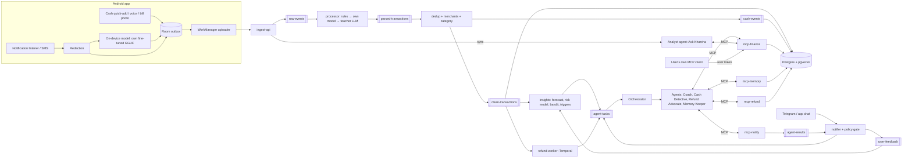

# Kharcha — Project Specification (v3, AI-first, all-Python backend)

> Living document. Audience: the developer and Claude Code. Sections are numbered so
> prompts can reference them ("implement §18.3"). "Kharcha" is a working name.

---

## 1. Vision and positioning

Most expense trackers fail because people stop entering data. Kharcha needs **zero manual
entry for digital payments**, makes **cash logging one tap or one chat message**, and uses a
**team of AI agents** that act like a funny, honest friend who watches your money: it roasts
unnecessary spending in Hinglish, warns you *before* risky moments, predicts when your
account hits zero, answers any question about your money, remembers what you promised
yourself, and fights for refunds you are owed.

### 1.1 Target users
Indian college students and young professionals on Android who pay mostly via UPI and
also use cash.

### 1.2 Competitive landscape (researched Sept 2026)
| Product | What it does | Gap Kharcha fills |
|---------|--------------|-------------------|
| Ask Google Pay (India, Jul 2026) | Gemini chatbot over the user's Google Pay history, 10 Indian languages; also recommends credit cards | Sees only its own app; reactive (you ask); no cash; no refunds; commercial incentive to sell credit |
| Cleo (US/UK) | AI money chat with Roast/Hype modes, budgets, subscriptions | Not in India; bank linking via Plaid; monetizes cash advances |
| FinArt, PennyWise, MonAI, Axio | Auto-track from bank SMS/notifications, categorize | Passive dashboards; no agents, no proactive nudges, no refunds |
| Asper, SpendLync, Budget.AI | Roast spending | Built for other markets/payment systems |

### 1.3 Differentiators (keep these true while building)
1. **Whole money picture**: every UPI app, cards, bank SMS **and cash** (missing-cash detective).
2. **Proactive, not reactive**: risk prediction + a bandit that learns which nudge works for each user.
3. **Broke-date forecast** as a probabilistic range, including cash, with what-ifs.
4. **Refund Watchdog**: failed payments tracked against RBI deadlines and compensation.
5. **Own fine-tuned model, on-device**: raw bank messages never leave the phone.
6. **No hidden agenda**: no credit or loan selling.
7. **Open data**: the user's own data is available to any AI assistant via MCP.

### 1.4 Success criteria (portfolio)
- Developer + 5–10 friends use it ≥ 4 weeks.
- Own fine-tuned small model within 3 points of the teacher model on field accuracy, runs on a mid-range phone with p95 < 3 s per message.
- Parsing field accuracy ≥ 95% (end-to-end with rules + model).
- Ask Kharcha execution accuracy ≥ 85% on a 120-question eval set.
- Forecast ±3-day accuracy ≥ 70% in backtests.
- Zero lost/duplicated transactions under chaos tests.
- Honest report on whether nudges reduced roastable spending (including "no effect").

---

## 2. Features

| ID | Feature | Phase |
|----|---------|-------|
| F1 | Background capture of bank/UPI notifications (+ SMS in sideload build) | 1 |
| F2 | Parsing: rules → own model → teacher LLM fallback, with validation | 1–4 |
| F3 | Telegram bot: summaries, roasts, chat cash entry | 1 |
| F4 | Dedup across sources; merchant normalization; categories | 2 |
| F5 | Automatic rule synthesis | 2 |
| F6 | Cash wallet: ATM detection, quick entry, missing-cash prompts | 2 |
| F7 | On-device redaction | 2 |
| F8 | Broke-date forecast (Monte Carlo, range, what-if) | 3 |
| F9 | Agent runtime (harness) + Coach agent + policy gate | 3 |
| F10 | Multi-user auth, basic cloud deploy, friends onboarding | 3 |
| F11 | **AI Pillar 1**: own fine-tuned parser model (distillation, LoRA, quantization, on-device) | 4 |
| F12 | **AI Pillar 2**: multi-agent system over Kafka with internal MCP servers | 5 |
| F13 | **AI Pillar 5**: long-term memory (facts, preferences, commitments) | 5 |
| F14 | **AI Pillar 3**: Ask Kharcha — conversational analyst (safe text-to-SQL + charts) | 6 |
| F15 | **AI Pillar 6**: bill-photo extraction, Hinglish voice entry | 6 |
| F16 | **AI Pillar 4**: risk prediction (ONNX) + contextual bandit nudges + experiment | 7 |
| F17 | Refund Watchdog (Temporal) + Refund Advocate agent | 8 |
| F18 | External MCP access for the user's own assistants | 5 |
| F19 | Production cloud (Terraform, k3s, Strimzi), monitoring, load & chaos tests | 9 |
| F20 | Stretch: Auto-Udhaar (detect money lent to friends from chats + UPI) | Stretch |
| F21 | Stretch: WhatsApp delivery, friend challenges | Stretch |

## 3. Non-goals
No money movement or payments; no bank account linking in v1; no iOS; no automatic
complaint submission; no investment/credit advice; no selling or sharing user data.

---

## 4. Architecture overview



### 4.1 Key design decisions
- **All-Python backend, one uv workspace, many small services** (each package is its own
  deployable process with its own Kafka consumer group). One language for API, pipeline, agents,
  MCP servers and ML keeps a solo project simple. (ADR-001)
- **Kafka backbone** (language-neutral): per-user ordering, replay of raw events, independent
  scaling, DLTs. Python services use **FastStream** with its Confluent backend. (ADR-002)
- **Postgres is the source of truth**; raw events stored (redacted) so replay outlives retention.
- **Temporal** (Python SDK) for multi-day refund workflows. (ADR-003)
- **Tiered parsing**: rules (free, instant) → own small model → teacher LLM. (ADR-004, ADR-011)
- **LiteLLM** for model portability (Ollama locally, free API tier when deployed), with
  **Pydantic** models for every structured output. (ADR-005)
- **Agents reach every capability through MCP servers** with per-agent tool permissions,
  so tools are reusable, auditable, and also usable by the user's own assistants. (ADR-012)
- **Agents propose, policy decides**: a deterministic policy gate (separate service) owns every
  user-facing message. (ADR-013)
- **Separate Python environments**: the backend workspace stays lean; heavy training dependencies
  (PyTorch, Transformers, PEFT) live only in `ml/`. (ADR-014)
- **One source of truth for event schemas**: Pydantic models in `kharcha-common`, exported as
  JSON Schema for the Kotlin app, checked by contract tests. (ADR-006)

---

## 5. Repository structure

```
kharcha/
├── CLAUDE.md
├── docs/  PROJECT_SPEC.md  PROGRESS.md  adr/
├── android-app/app/src/main/java/in/kharcha/app/     # Kotlin sources
│   ├── capture/  redact/  llm/ (llama.cpp JNI + JSON-grammar decoding)
│   ├── data/  sync/  ui/  widget/  voice/  camera/
├── backend/                         # uv workspace (Python 3.12)
│   ├── pyproject.toml               # workspace root: members = packages/*
│   ├── uv.lock
│   ├── alembic.ini
│   ├── migrations/                  # Alembic versions (V1 core, V2 ai, V3 analyst)
│   ├── packages/
│   │   ├── common/        src/kharcha_common/     events (Pydantic), topics, money, time, db models, settings
│   │   ├── ingest_api/    src/kharcha_ingest/     FastAPI app
│   │   ├── processor/     src/kharcha_processor/  parser, rules, dedup, merchants, cash
│   │   ├── insights/      src/kharcha_insights/   forecast, risk scoring (onnxruntime), bandit, triggers
│   │   ├── agent_runtime/ src/kharcha_runtime/    agent loop, limits, permissions, grounding, replay
│   │   ├── agents/        src/kharcha_agents/     orchestrator, coach, cash_detective, refund_advocate, memory_keeper, analyst
│   │   ├── mcp_finance/   src/kharcha_mcp_finance/
│   │   ├── mcp_memory/    src/kharcha_mcp_memory/
│   │   ├── mcp_notify/    src/kharcha_mcp_notify/
│   │   ├── mcp_refund/    src/kharcha_mcp_refund/
│   │   ├── notifier/      src/kharcha_notifier/   policy gate, Telegram, FCM, feedback
│   │   └── refund_worker/ src/kharcha_refund/     Temporal workflows + activities
│   ├── prompts/                     # <agent>/vN.md (versioned prompts)
│   ├── seeds/                       # seed-rules.yaml, seed-merchants.yaml, refund-rules.yaml
│   ├── schemas/                     # JSON Schema exported from Pydantic (for Android + contract tests)
│   └── tests/                       # cross-package integration + contract tests
├── ml/                              # separate uv project (heavy training deps)
│   ├── pyproject.toml
│   ├── src/kharcha_ml/
│   │   ├── dataset/   distill/   finetune/   eval/   export/   risk/
│   ├── notebooks/                   # Kaggle/Colab wrappers over the package
│   └── data/                        # gitignored real data; samples/ synthetic only
├── infra/  docker-compose.yml  k8s/  terraform/  prometheus/  grafana/
└── tools/  label_cli/  load/ (Locust)  chaos/
```

Each backend package exposes a console entry point (e.g. `kharcha-processor`) and has its own
Dockerfile built from a shared base image.

---

## 6. Tech stack

| Layer | Choice | Notes |
|-------|--------|-------|
| Mobile | Kotlin, Jetpack Compose, Hilt, Room, WorkManager, Glance, CameraX | Android only |
| On-device LLM | llama.cpp via JNI (GGUF, Q4), JSON-schema/GBNF constrained decoding | fallback: server model |
| Language | Python 3.12, `uv` workspace, `ruff`, `mypy --strict` | async throughout |
| API | FastAPI + Pydantic v2, Uvicorn | |
| Config | pydantic-settings (env-based; profiles `local`, `test`, `prod`) | |
| Streaming | Apache Kafka (KRaft) + **FastStream** (Confluent backend) | own retry/DLT layer (§7.2) |
| Workflows | Temporal (Python SDK) | refunds |
| Database | PostgreSQL + `pg_trgm` + **pgvector** + RLS; SQLAlchemy 2 (async, asyncpg); **Alembic** | |
| Cache | Redis (`redis-py` asyncio) | rate limits, alias cache, link codes |
| LLM access | **LiteLLM** (Ollama locally, free API tier deployed) + Pydantic structured outputs | per-agent config |
| Embeddings | small embedding model via Ollama (dimension configurable) | memory search |
| MCP | Official **MCP Python SDK** (servers + clients; streamable HTTP, stdio) | |
| Classic ML | LightGBM → ONNX (training in `ml/`); **onnxruntime** for inference in `insights` | |
| Fine-tuning | Hugging Face Transformers + PEFT/TRL (or Unsloth) on free Kaggle/Colab GPUs | `ml/` only |
| Resilience | tenacity (retries), aiobreaker (circuit breaker) | |
| Scheduling | Temporal schedules (preferred) or APScheduler | |
| Messaging | Telegram Bot API (python-telegram-bot or aiogram), Firebase Cloud Messaging (firebase-admin) | |
| Auth | Firebase Auth; tokens verified with firebase-admin in a FastAPI dependency | |
| Charts | matplotlib (server-side PNG) | |
| SQL safety | **sqlglot** (parse/validate/rewrite) | Ask Kharcha |
| Infra | Docker, k3s, Terraform, GitHub Actions, multi-arch images | ARM free tier |
| Observability | OpenTelemetry (FastAPI/Kafka/SQLAlchemy instrumentation), prometheus-client, Grafana, Langfuse | |
| Testing | pytest, pytest-asyncio, Hypothesis, testcontainers-python, import-linter, Temporal test env, Locust | |

> Pin versions in `uv.lock`; check compatibility (FastStream ↔ confluent-kafka, Temporal SDK,
> MCP SDK, llama.cpp Android build, ONNX opset) at the start of each phase; record choices in ADRs.

---

## 7. Event contracts and Kafka topics

### 7.1 Envelope (all topics, JSON)
```json
{
  "eventId": "0190f3a2-7c1e-7b3a-9d2e-4b1f6a0c9e11",
  "userId": "u_8f2k1",
  "type": "RAW_NOTIFICATION",
  "schemaVersion": 1,
  "occurredAt": "2026-10-03T13:45:12Z",
  "producedAt": "2026-10-03T13:45:20Z",
  "producer": "ingest-api",
  "causationId": null,
  "payload": {}
}
```
`eventId` is UUIDv7, generated on the phone for raw events. OpenTelemetry context in headers.

### 7.2 Topics
| Topic | Key | Partitions (local/prod) | Retention | Producer → Consumer |
|-------|-----|------------------------|-----------|---------------------|
| `raw-events` | userId | 3 / 12 | 30 d | ingest-api, notifier → processor |
| `parsed-transactions` | userId | 3 / 12 | 7 d | processor.parser → processor.dedup |
| `clean-transactions` | userId | 3 / 12 | 7 d | dedup → insights, refund-worker, db-writer |
| `cash-events` | userId | 3 / 12 | 7 d | dedup, notifier → processor.cash |
| `agent-tasks` | userId | 3 / 12 | 3 d | insights, notifier, refund-worker, scheduler → orchestrator/agents |
| `agent-results` | userId | 3 / 12 | 7 d | agents → orchestrator → notifier |
| `user-feedback` | userId | 3 / 6 | 30 d | notifier → insights (bandit), agents (memory) |
| `nudge-outcomes` | userId | 3 / 6 | 30 d | insights → bandit updater |
| `model-shadow` | userId | 3 / 3 | 7 d | processor → eval collector (shadow comparisons) |
| `<topic>.DLT` | userId | same | 30 d | shared retry/DLT middleware in `kharcha_common` |

Producers `acks=all`, idempotence on. Consumers commit offsets only after the DB transaction
commits (manual ack in FastStream). A shared middleware retries 3× with exponential backoff
(tenacity) and then publishes the original message + error headers to `.DLT`. Replay tool republishes stored raw events with `replay=true`.

### 7.3 Payloads

**RawEventPayload** — `type`: RAW_NOTIFICATION | RAW_SMS | MANUAL_TEXT | MANUAL_VOICE | WIDGET_TAP | BILL_PHOTO
```json
{
  "sourceApp": "com.phonepe.app",
  "sender": "AX-HDFCBK",
  "title": "Paid to Zomato",
  "text": "Paid Rs.349.00 to zomato@hdfcbank from A/c XX1234. UPI Ref 412345678901",
  "postedAt": "2026-10-03T13:45:12Z",
  "deviceId": "d_91ab",
  "redacted": true,
  "replay": false,
  "deviceParse": {
    "modelVersion": "kharcha-parser-1.5b-q4-v3",
    "result": { "amountPaise": 34900, "direction": "DEBIT", "channel": "UPI", "status": "SUCCESS",
                "merchantRaw": "zomato@hdfcbank", "referenceId": "412345678901" },
    "latencyMs": 820
  }
}
```
`deviceParse` is optional (present when the on-device model ran). The server re-validates
it and may re-parse; the server's result is authoritative.

**ParsedTransactionPayload**
```json
{
  "rawEventId": "…", "amountPaise": 34900, "currency": "INR",
  "direction": "DEBIT", "channel": "UPI", "status": "SUCCESS",
  "merchantRaw": "zomato@hdfcbank", "counterpartyVpa": "zomato@hdfcbank",
  "referenceId": "412345678901", "accountHint": "1234", "balanceAfterPaise": null,
  "txnTime": "2026-10-03T13:45:12Z",
  "parseMethod": "RULE | DEVICE_MODEL | SERVER_MODEL | TEACHER_LLM",
  "modelVersion": null, "ruleId": "r_hdfc_upi_debit_v3", "confidence": 0.99,
  "promisedRefundDays": null
}
```
Enums — direction: DEBIT|CREDIT; channel: UPI|CARD|ATM|NETBANKING|WALLET|CASH|UNKNOWN;
status: SUCCESS|FAILED|PENDING|REVERSED|REFUND_INITIATED.

**CleanTransactionPayload**
```json
{
  "transactionId": "t_…", "amountPaise": 34900, "direction": "DEBIT",
  "kind": "SPEND", "status": "SUCCESS", "merchantId": "m_zomato", "merchantName": "Zomato",
  "category": "FOOD_DELIVERY", "isEssential": false, "referenceId": "412345678901",
  "txnTime": "2026-10-03T13:45:12Z", "sourceEventIds": ["…"], "version": 2
}
```
kind: SPEND | INCOME | SELF_TRANSFER | REFUND | REVERSAL | COMPENSATION | ATM_WITHDRAWAL |
CASH_SPEND | CASH_IN | UNACCOUNTED_CASH. Consumers upsert by `transactionId` + `version`.

**CashEventPayload**: `{ entryType, amountPaise, category?, note?, relatedTransactionId? }`
(entryType: ATM_WITHDRAWAL | CASH_RECEIVED | CASH_SPEND | UNACCOUNTED).

**AgentTaskPayload**
```json
{
  "taskId": "at_…",
  "agent": "COACH | CASH_DETECTIVE | REFUND_ADVOCATE | MEMORY_KEEPER",
  "trigger": "WEEKLY_REVIEW | RISK_MOMENT | MISSING_CASH | REFUND_OVERDUE | FEEDBACK | USER_MESSAGE | BUDGET | FREQUENCY | BROKE_DATE_MOVED",
  "goal": "Weekly review for week 2026-W40",
  "contextRefs": { "week": "2026-W40", "riskScoreId": null, "refundCaseId": null, "withdrawalId": null },
  "banditDecision": null,
  "deadline": "2026-10-04T06:00:00Z",
  "priority": "LOW | NORMAL | HIGH",
  "dedupeKey": "freq:zomato@hdfcbank:2026-W40"
}
```
`BUDGET`, `FREQUENCY` and `BROKE_DATE_MOVED` carry the §22.1 deterministic triggers. `dedupeKey`
(optional) becomes `alerts_sent.dedupe_key`, so a re-delivered task never produces a second alert.
**AgentResultPayload**: `{ taskId, agent, runId, status, proposals: [Proposal], memoryWrites: [..], drafts: [..] }`
where `Proposal = { type, text, category?, buttons[], reason, groundingNumbers[] }`.

**UserFeedbackPayload**: `{ alertId, reaction: FAIR|NOT_FAIR|NECESSARY|FUNNY|MUTE_CATEGORY, category? }`
or `{ alertId, cashAnswer: {category, amountPaise} | DONT_REMEMBER }`.

**NudgeOutcomePayload**: `{ decisionId, arm, contextBucket, propensity, reward, rewardComponents }`.

**ModelShadowPayload** (topic `model-shadow`, §10.5): `{ rawEventId, tierResults: [TierResult], agreement }`
where `TierResult = { parseMethod, version (rule id or model version), outcome: TRANSACTION |
NOT_TRANSACTION | FAILED, amountPaise?, direction?, status?, merchantRaw?, referenceId? }`.
No message text. Added in W5 as a new event type (existing schemas unchanged, `schemaVersion` stays 1).

---

## 8. Data model (PostgreSQL)

Alembic revisions `0001_core` and `0002_ai` (raw SQL via `op.execute` is fine for these DDL blocks). Abbreviated; add indexes as shown.

```sql
-- 0001_core
CREATE EXTENSION IF NOT EXISTS pg_trgm;

CREATE TABLE users (
  id TEXT PRIMARY KEY, firebase_uid TEXT UNIQUE, display_name TEXT,
  timezone TEXT NOT NULL DEFAULT 'Asia/Kolkata',
  roast_level TEXT NOT NULL DEFAULT 'MEDIUM',          -- OFF|MILD|MEDIUM|SAVAGE
  telegram_chat_id BIGINT UNIQUE,
  experiment_group TEXT,                               -- BANDIT|PLAIN|NULL
  ml_consent BOOLEAN NOT NULL DEFAULT false,           -- allow redacted data for training
  quiet_start TIME NOT NULL DEFAULT '22:00', quiet_end TIME NOT NULL DEFAULT '08:00',
  created_at TIMESTAMPTZ NOT NULL DEFAULT now()
);
CREATE TABLE devices (id TEXT PRIMARY KEY, user_id TEXT NOT NULL REFERENCES users(id),
  fcm_token TEXT, app_version TEXT, device_model TEXT, on_device_llm BOOLEAN DEFAULT false,
  created_at TIMESTAMPTZ NOT NULL DEFAULT now());

CREATE TABLE raw_events (event_id UUID PRIMARY KEY, user_id TEXT NOT NULL REFERENCES users(id),
  type TEXT NOT NULL, source_app TEXT, sender TEXT, title TEXT, text TEXT,
  device_parse JSONB, posted_at TIMESTAMPTZ NOT NULL, received_at TIMESTAMPTZ NOT NULL DEFAULT now());
CREATE INDEX ON raw_events (user_id, posted_at);

CREATE TABLE processed_events (consumer TEXT NOT NULL, event_id UUID NOT NULL,
  processed_at TIMESTAMPTZ NOT NULL DEFAULT now(), PRIMARY KEY (consumer, event_id));

CREATE TABLE parse_rules (id TEXT PRIMARY KEY, sender_pattern TEXT, regex TEXT NOT NULL,
  field_map JSONB NOT NULL, status TEXT NOT NULL,     -- CANDIDATE|ACTIVE|DISABLED
  origin TEXT NOT NULL, match_count INT NOT NULL DEFAULT 0, mismatch_count INT NOT NULL DEFAULT 0,
  created_at TIMESTAMPTZ NOT NULL DEFAULT now());

CREATE TABLE merchants (id TEXT PRIMARY KEY, name TEXT NOT NULL, default_category TEXT NOT NULL);
CREATE TABLE merchant_aliases (alias TEXT PRIMARY KEY, merchant_id TEXT NOT NULL REFERENCES merchants(id),
  source TEXT NOT NULL);                               -- SEED|RULE|LLM|USER
CREATE INDEX ON merchant_aliases USING gin (alias gin_trgm_ops);

CREATE TABLE transactions (
  id TEXT PRIMARY KEY, user_id TEXT NOT NULL REFERENCES users(id),
  amount_paise BIGINT NOT NULL CHECK (amount_paise > 0),
  direction TEXT NOT NULL, kind TEXT NOT NULL, status TEXT NOT NULL, channel TEXT NOT NULL,
  merchant_id TEXT REFERENCES merchants(id), merchant_raw TEXT,
  category TEXT NOT NULL, is_essential BOOLEAN NOT NULL,
  reference_id TEXT, account_hint TEXT, balance_after_paise BIGINT,
  txn_time TIMESTAMPTZ NOT NULL, parse_method TEXT NOT NULL, user_corrected BOOLEAN NOT NULL DEFAULT false,
  version INT NOT NULL DEFAULT 1,
  created_at TIMESTAMPTZ NOT NULL DEFAULT now(), updated_at TIMESTAMPTZ NOT NULL DEFAULT now());
CREATE INDEX ON transactions (user_id, txn_time);
CREATE INDEX ON transactions (user_id, reference_id);
CREATE INDEX ON transactions (user_id, amount_paise, txn_time);

CREATE TABLE transaction_sources (transaction_id TEXT NOT NULL REFERENCES transactions(id),
  raw_event_id UUID NOT NULL REFERENCES raw_events(event_id), PRIMARY KEY (transaction_id, raw_event_id));

CREATE TABLE cash_ledger (id TEXT PRIMARY KEY, user_id TEXT NOT NULL REFERENCES users(id),
  entry_type TEXT NOT NULL, amount_paise BIGINT NOT NULL CHECK (amount_paise > 0),
  category TEXT, note TEXT, related_transaction_id TEXT REFERENCES transactions(id),
  occurred_at TIMESTAMPTZ NOT NULL, prompted BOOLEAN NOT NULL DEFAULT false);
CREATE INDEX ON cash_ledger (user_id, occurred_at);

CREATE TABLE budgets (user_id TEXT NOT NULL REFERENCES users(id), category TEXT NOT NULL,
  monthly_limit_paise BIGINT NOT NULL, PRIMARY KEY (user_id, category));

CREATE TABLE forecasts (id TEXT PRIMARY KEY, user_id TEXT NOT NULL REFERENCES users(id),
  computed_at TIMESTAMPTZ NOT NULL, balance_now_paise BIGINT NOT NULL,
  broke_p20 DATE, broke_p50 DATE, broke_p80 DATE, horizon_days INT NOT NULL, inputs JSONB NOT NULL);

CREATE TABLE alerts_sent (id TEXT PRIMARY KEY, user_id TEXT NOT NULL REFERENCES users(id),
  alert_type TEXT NOT NULL, text TEXT NOT NULL, dedupe_key TEXT, agent_run_id TEXT,
  nudge_decision_id TEXT, sent_at TIMESTAMPTZ, status TEXT NOT NULL); -- QUEUED|SENT|SUPPRESSED|FAILED
CREATE UNIQUE INDEX ON alerts_sent (user_id, dedupe_key) WHERE dedupe_key IS NOT NULL;
CREATE TABLE alert_feedback (alert_id TEXT NOT NULL REFERENCES alerts_sent(id), reaction TEXT NOT NULL,
  created_at TIMESTAMPTZ NOT NULL DEFAULT now(), PRIMARY KEY (alert_id, reaction));

CREATE TABLE refund_cases (id TEXT PRIMARY KEY, user_id TEXT NOT NULL REFERENCES users(id),
  case_type TEXT NOT NULL, transaction_id TEXT NOT NULL REFERENCES transactions(id),
  amount_paise BIGINT NOT NULL, reference_id TEXT, opened_at TIMESTAMPTZ NOT NULL,
  deadline_at TIMESTAMPTZ NOT NULL, state TEXT NOT NULL, reversed_at TIMESTAMPTZ,
  compensation_owed_paise BIGINT DEFAULT 0, compensation_received_paise BIGINT DEFAULT 0,
  workflow_id TEXT UNIQUE, complaint_draft TEXT, updated_at TIMESTAMPTZ NOT NULL DEFAULT now());
```

```sql
-- 0002_ai
CREATE EXTENSION IF NOT EXISTS vector;

CREATE TABLE agent_runs (id TEXT PRIMARY KEY, user_id TEXT NOT NULL REFERENCES users(id),
  task_id TEXT, agent TEXT NOT NULL, prompt_version TEXT NOT NULL, model TEXT NOT NULL,
  started_at TIMESTAMPTZ NOT NULL, finished_at TIMESTAMPTZ,
  status TEXT NOT NULL,                               -- OK|BUDGET_EXCEEDED|ERROR|TIMEOUT|DENIED_TOOL
  transcript JSONB NOT NULL,                          -- messages, tool calls, tool results (replay)
  input_tokens INT, output_tokens INT, cost_micros BIGINT DEFAULT 0);
CREATE INDEX ON agent_runs (user_id, agent, started_at);

CREATE TABLE memories (id TEXT PRIMARY KEY, user_id TEXT NOT NULL REFERENCES users(id),
  kind TEXT NOT NULL,                                 -- FACT|PREFERENCE|COMMITMENT|EPISODE
  content TEXT NOT NULL, embedding vector(768),       -- dimension must match the embedding model
  confidence REAL NOT NULL DEFAULT 0.7, source_run_id TEXT,
  due_at TIMESTAMPTZ, status TEXT NOT NULL DEFAULT 'ACTIVE', -- ACTIVE|FULFILLED|BROKEN|FORGOTTEN
  last_used_at TIMESTAMPTZ, created_at TIMESTAMPTZ NOT NULL DEFAULT now(),
  updated_at TIMESTAMPTZ NOT NULL DEFAULT now());
CREATE INDEX ON memories USING hnsw (embedding vector_cosine_ops);
CREATE INDEX ON memories (user_id, kind, status);

CREATE TABLE risk_scores (id TEXT PRIMARY KEY, user_id TEXT NOT NULL REFERENCES users(id),
  scored_at TIMESTAMPTZ NOT NULL, window_start TIMESTAMPTZ NOT NULL, window_end TIMESTAMPTZ NOT NULL,
  probability REAL NOT NULL, model_version TEXT NOT NULL, features JSONB NOT NULL);
CREATE INDEX ON risk_scores (user_id, scored_at);

CREATE TABLE nudge_decisions (id TEXT PRIMARY KEY, user_id TEXT NOT NULL REFERENCES users(id),
  risk_score_id TEXT REFERENCES risk_scores(id), context_bucket TEXT NOT NULL,
  arm TEXT NOT NULL, propensity REAL NOT NULL, policy_version TEXT NOT NULL,
  decided_at TIMESTAMPTZ NOT NULL, reward REAL, reward_components JSONB, rewarded_at TIMESTAMPTZ);

CREATE TABLE bandit_state (scope TEXT NOT NULL,       -- 'global' or user id
  context_bucket TEXT NOT NULL, arm TEXT NOT NULL,
  alpha REAL NOT NULL DEFAULT 1, beta REAL NOT NULL DEFAULT 1, updated_at TIMESTAMPTZ NOT NULL DEFAULT now(),
  PRIMARY KEY (scope, context_bucket, arm));

CREATE TABLE model_versions (id TEXT PRIMARY KEY, kind TEXT NOT NULL,  -- PARSER|RISK|EMBEDDING
  base_model TEXT, artifact_uri TEXT NOT NULL, sha256 TEXT NOT NULL,
  eval_report JSONB NOT NULL, status TEXT NOT NULL,   -- CANDIDATE|SHADOW|ACTIVE|RETIRED
  created_at TIMESTAMPTZ NOT NULL DEFAULT now());

CREATE TABLE eval_runs (id TEXT PRIMARY KEY, suite TEXT NOT NULL, -- PARSER|ASK|AGENT|FORECAST|RISK
  subject TEXT NOT NULL, metrics JSONB NOT NULL, git_sha TEXT, created_at TIMESTAMPTZ NOT NULL DEFAULT now());

CREATE TABLE ask_sessions (id TEXT PRIMARY KEY, user_id TEXT NOT NULL REFERENCES users(id),
  question TEXT NOT NULL, answer TEXT, sql_executed TEXT[], chart_uri TEXT, run_id TEXT,
  rating SMALLINT, created_at TIMESTAMPTZ NOT NULL DEFAULT now());
```

### 8.1 Analyst views and row-level security (for Ask Kharcha)
```sql
-- 0003_analyst
CREATE ROLE kharcha_analyst NOLOGIN;
CREATE VIEW v_transactions AS
  SELECT id, user_id, txn_time AT TIME ZONE 'Asia/Kolkata' AS txn_time_ist,
         (amount_paise / 100.0)::numeric(12,2) AS amount_rupees,
         direction, kind, category, is_essential, merchant_raw,
         (SELECT name FROM merchants m WHERE m.id = t.merchant_id) AS merchant
  FROM transactions t;
-- Similar: v_cash_ledger, v_budgets, v_forecasts (no raw text, no account hints)
ALTER VIEW v_transactions SET (security_barrier = true);
-- RLS is applied on base tables with a policy using current_setting('app.user_id');
-- the analyst connection runs: BEGIN READ ONLY; SET LOCAL app.user_id = '<id>';
--                              SET LOCAL statement_timeout = '3s'; <query>; COMMIT;
GRANT SELECT ON v_transactions, v_cash_ledger, v_budgets, v_forecasts TO kharcha_analyst;
```

---

## 9. REST API (ingest-api)

All under `/v1`, JSON, Firebase ID token auth (Phase 1: static per-user API key).

| Method | Path | Purpose |
|--------|------|---------|
| POST | `/v1/events:batch` | Upload ≤ 100 raw events; idempotent on `eventId` |
| POST | `/v1/cash` | Manual cash entry |
| POST | `/v1/bill-photo` | Multipart image → extraction draft for confirmation (§21) |
| GET | `/v1/transactions` | Cursor-paginated list, filters |
| PATCH | `/v1/transactions/{id}` | User correction → aliases, training signal |
| GET | `/v1/summary?period=` | Category totals, top merchants, essential vs not |
| GET | `/v1/forecast` | Latest p20/p50/p80, balance, what-if (`?skip=FOOD_DELIVERY`) |
| GET | `/v1/cash/balance` | Cash in hand, unaccounted |
| POST | `/v1/ask` | Ask Kharcha: `{question}` → `{answer, chartUrl?, followUps[]}` (sync, ≤ 20 s) |
| GET/DELETE | `/v1/memories`, `/v1/memories/{id}` | View / forget memories |
| GET/PUT | `/v1/settings` | roast level, quiet hours, budgets, allowlist, experiment opt-in, ML consent |
| POST | `/v1/telegram/link-code` | 6-digit code for `/start <code>` |
| GET | `/v1/refund-cases` | List cases |
| POST | `/v1/refund-cases/{id}/submitted` | User confirms submission |
| POST | `/v1/mcp-tokens` | Create a personal token for external MCP clients (§24) |
| DELETE | `/v1/me` | Delete all data (§28.4) |
| GET | `/v1/models/parser/latest` | On-device model manifest (version, URL, sha256, min RAM) |

Validation: `redacted` must be true; text ≤ 2,000 chars; `postedAt` within [now−400 d, now+5 min].

---

## 10. Parsing pipeline (tiered)

### 10.1 Tiers
| Tier | Where | Cost | When used |
|------|-------|------|-----------|
| 0. Pre-filter | server (and phone) | free | drop OTPs, promos, "cashback up to", balance-only; count every drop by reason |
| 1. Rules | server | free, < 1 ms | ACTIVE rule for the sender matches |
| 2. Own model on device | phone | free, ~1 s | no rule matched on the phone's cached rule set |
| 3. Own model on server | Ollama serving our GGUF | free (CPU) | device lacks on-device model, or device result failed validation |
| 4. Teacher LLM | free API tier / larger local model | limited quota | tiers 2–3 failed validation or low confidence |

The phone downloads a compact copy of ACTIVE rules daily and applies tiers 0–2 locally.
The server always re-runs validation and tiers 1/3/4 as needed; server output is authoritative.

### 10.2 Validation (all tiers)
- `amountPaise > 0`, and the amount's digits **appear in the source text** (anti-hallucination);
  same for `referenceId`.
- Direction consistent with keywords (debited/paid/sent vs credited/received).
- Status FAILED only with failure keywords; REVERSED only with reversal/refund keywords.
- Failure → next tier; after tier 4 → `.DLT` with reason.
- Amount parser handles `Rs.349`, `Rs 349.00`, `INR 1,249.50`, `₹2,000`, `1,00,000`.
  Exhaustive unit + property tests.

### 10.3 Extraction prompt / output schema (tiers 2–4 share it)
```
System: Extract ONE financial transaction from an Indian bank/UPI message.
Return ONLY JSON matching the schema. If it is not a completed/failed/pending transaction,
return {"isTransaction": false}. Copy the amount exactly as written. Use null for unknowns.
User: sender=<sender> app=<sourceApp>
message=<<<redacted text>>>
```
Schema: `{isTransaction, amount, direction, channel, status, merchantRaw, counterpartyVpa,
referenceId, accountHint, balanceAfter, promisedRefundDays}`. Tier 2/3 use **constrained
decoding** (JSON schema / GBNF grammar) so output is always valid JSON. Temperature 0.

### 10.4 Rule synthesis
When tiers 2–4 parse successfully: collect ≤ 5 recent model-parsed events from the same
sender → teacher writes a regex with named groups (`amount`, `merchant`, `ref`, `acct`, `bal`)
+ static `field_map` → validated in code (compile guard, reject nested quantifiers, run on all
samples, fields must equal the model's extractions) → CANDIDATE → shadow mode → ACTIVE after 5
consistent matches → auto-DISABLE if `mismatch_count > 2`.
Metric: `kharcha_parse_method_total{method}`; target: rules handle ≥ 85% after 4 weeks.

### 10.5 Shadow comparisons
For a sample (10%) of events, run the other tiers too and publish `model-shadow` records
`{eventId, tierResults[], agreement}`. Used to monitor model drift and to find new training data.

---

## 11. Dedup and merchant normalization

### 11.1 Matching (per user, serial because key = userId)
Candidates: same user, same `amountPaise` and `direction`, `|Δt| ≤ 15 min`
(48 h if `referenceId` present).
- Same `referenceId` → definite merge.
- Else score: +0.4 amount & direction (required), +0.3 Δt ≤ 3 min, +0.2 compatible merchant
  (trigram ≥ 0.4 or same VPA), +0.1 same `accountHint`. Merge if ≥ 0.8; 0.6–0.8 merge only if
  source types differ (SMS vs notification). Two notifications from the same app → separate
  transactions.
On merge: keep richest fields, add `transaction_sources`, bump `version`, republish.

### 11.2 Special cases
Failed-then-reversed (link, kind REVERSAL, closes refund case); self-transfer (debit + credit
same amount across own accounts ≤ 10 min → SELF_TRANSFER, excluded); refunds from previously
paid merchants (REFUND); ATM debit (ATM_WITHDRAWAL + `cash-events`).

### 11.3 Merchant normalization
Normalize raw (lowercase, strip ids/handles/`pvt ltd`) → exact alias (Redis-cached) → trigram
≥ 0.6 → teacher suggestion (saved `source=LLM`) → user corrections (`source=USER`, win for
that user). Person VPAs → TRANSFERS, never roasted. Seed ~150 Indian merchants in YAML.

---

## 12. Category taxonomy

| Category | Essential | Roastable |
|----------|-----------|-----------|
| FOOD_DELIVERY | no | yes |
| DINING_OUT | no | yes |
| QUICK_COMMERCE_SNACKS | no | yes |
| GROCERIES | yes | extreme spikes only |
| SHOPPING | no | yes |
| ENTERTAINMENT | no | yes |
| SUBSCRIPTIONS | no | duplicates/unused |
| TRAVEL | no | gently |
| TRANSPORT | yes | no |
| BILLS_UTILITIES, RENT, HEALTH, EDUCATION | yes | never |
| TRANSFERS | n/a | never |
| CASH_UNCATEGORIZED | no | "vanishing cash" style only |
| OTHER | no | no |

User can override per category.

---

## 13. Cash wallet

- Balance = Σ(ATM_WITHDRAWAL + CASH_RECEIVED) − Σ(CASH_SPEND + UNACCOUNTED); never show
  negative — show "₹X more than tracked cash" instead.
- Logging: Telegram text (`150 vada pav`, `chai 20`, `got 500 from mom`, `1.2k shoes`: rule
  parser first, own model/teacher fallback), app quick-add, Glance widget presets, Hinglish
  voice (§21), bill photo (§21). Every entry gets an **Undo** button.
- Missing cash is handled by the **Cash Detective agent** (§17.4): triggered when a withdrawal
  is > 72 h old and logged cash spends < 60% of it.

---

## 14. Broke-date forecast (insights.forecast)

Inputs: bank balance (latest `balance_after_paise` ≤ 3 days old, else last known + net since,
else ask once), cash in hand, recurring items (same merchant, amount ±10%, ~7 or ~30 day
interval ±3, ≥ 2–3 occurrences), recurring income, daily discretionary spend (60 days, by weekday).

Method: Monte Carlo, N = 2,000 runs × 45 days (bootstrap discretionary spend by weekday,
add scheduled recurring payments and income). Broke day = first day ≤ 0. Report p20/p50/p80.
What-if: reduce a category's discretionary spend and report days gained.
Pure function `ForecastInput → ForecastResult`. Backtest task reports ±3-day accuracy and MAE.

---

## 15. AI Pillar 1 — Our own fine-tuned parser model

### 15.1 Goal
A small model (≈0.5–1.5B parameters) specialized for Indian bank/UPI/wallet messages that
(a) matches the teacher within 3 points of field accuracy, (b) runs on a mid-range Android
phone, (c) costs nothing per message, and (d) keeps raw messages on the device.

### 15.2 Data
Sources (all redacted):
1. Developer's and consenting friends' real messages (`ml_consent = true`).
2. **Synthetic messages**: a generator with templates per bank/app × amounts × merchants ×
   statuses × formatting noise (line breaks, truncation, Hindi words, emoji), to cover banks
   nobody in the group uses. Templates are written by hand from public examples of formats,
   never copied from real user data.
3. Hard negatives: OTPs, promos, balance-only, "cashback up to ₹500" messages.

Labels:
- **Distillation**: the teacher labels every example with the §10.3 schema.
- **Human review queue** (`tools/dataset-label-cli`): all disagreements between teacher and
  rules, a 10% random sample, and every low-confidence item. Reviewed labels win.

### 15.3 Splits (avoid leakage)
- Group by **sender template signature** (message with numbers/names masked). A template
  appears in exactly one split.
- `gold_test` (≥ 500, 100% human-verified, includes held-out banks) is frozen and **never
  trained on**. `val` for early stopping. Near-duplicate removal (MinHash) across splits.
- Record dataset version, counts per source/bank/status in `ml/data/DATASET_CARD.md`.

### 15.4 Training
- Base: evaluate 2–3 small instruct models (e.g., Qwen- or Gemma-class ~0.5–1.5B) zero-shot
  on `val`; pick the best as base.
- LoRA SFT (PEFT/TRL or Unsloth), prompt = §10.3, target = JSON only; loss on target tokens only.
- Starting hyperparameters: rank 16, alpha 32, dropout 0.05, lr 2e-4, 2–3 epochs, max seq 384,
  bf16/fp16 as the GPU allows. Log to a JSON metrics file (and optionally W&B free tier).
- Train on free notebook GPUs (Kaggle/Colab — check current quotas); notebooks only call
  `kharcha_ml.finetune.train` so everything stays reproducible from the package.

### 15.5 Evaluation (`kharcha_ml.eval.parser`)
Compare on `gold_test`: rules-only, base model zero-shot, fine-tuned (fp16), fine-tuned (Q4
GGUF), teacher.
Metrics: JSON validity, `isTransaction` F1, exact match per field (amount, direction,
status, merchant, reference), all-fields exact match, per-bank breakdown, latency and peak
RAM on a real phone (p50/p95), model file size.
Output `eval_report.json` + `eval_report.md`; stored in `model_versions.eval_report`.
**Promotion gate**: all-fields exact match ≥ teacher − 3 pts and amount accuracy ≥ 99%.

### 15.6 Export and serving
- Merge LoRA → convert to GGUF → quantize (Q4_K_M; compare Q5 if accuracy drops) with
  llama.cpp tools. Record sha256.
- **Server**: load the GGUF in Ollama as `kharcha-parser:<version>` (tier 3).
- **Phone**: app checks `/v1/models/parser/latest`, downloads over Wi-Fi only if device RAM
  ≥ threshold, verifies sha256, runs via llama.cpp JNI with grammar-constrained JSON, 1 thread
  in background work, timeout 5 s. Devices below threshold skip tier 2.

### 15.7 Rollout
CANDIDATE → SHADOW (runs alongside current tier, compared via `model-shadow`) → ACTIVE when
live agreement ≥ 98% over 500 events → previous version RETIRED. One-click rollback by
switching `status`.

### 15.8 Continuous improvement
Weekly job collects disagreements + user corrections into the review queue; new labeled
data → retrain monthly → same gates. Report the accuracy curve across versions.

---

## 16. Agent runtime (backend/agent-runtime) — the harness

All agents run inside one shared runtime. This is where "agent harness" skills live.

### 16.1 Loop
Our own loop in `kharcha_runtime` (no agent framework; LiteLLM is used only for single model
calls): build context → model call → if tool calls: check permission
→ execute via MCP client → append result → repeat → stop on final answer or limit.

### 16.2 Limits (per agent config, enforced in code)
| Limit | Default |
|-------|---------|
| Max iterations | 8 |
| Max input tokens (total) | 12k |
| Max wall time | 60 s (Analyst: 20 s) |
| Max proposals | 3 |
| Max tool calls per tool | 4 |
Exceeding any → stop, status BUDGET_EXCEEDED/TIMEOUT, no proposals emitted.

### 16.3 Tool permissions
Each agent has an allowlist of MCP tools (§17.3). A call outside it → structured error to the
model + status DENIED_TOOL recorded; repeated attempts end the run.

### 16.4 Safety and grounding
- Tool errors are returned as structured results, never thrown into the model.
- Every proposal carries `groundingNumbers[]`; the runtime checks every number/amount/date in
  the text appears in tool results from this run (§27.4). Failure → one regeneration → drop.
- Content filter (§22.2) runs before a proposal leaves the runtime.
- All tool outputs are treated as data; merchant/message text is wrapped in delimiters.

### 16.5 Observability and replay
- Full transcript (messages, tool calls, results, timings, tokens) saved in `agent_runs`;
  spans exported to Langfuse/OpenTelemetry.
- `ReplayModel` + `ReplayToolExecutor` (implement the runtime's model/tool protocols) re-run any
  recorded run deterministically.
- Regression mode: new prompt/model against recorded tool results; diff proposals.

### 16.6 Model routing
Per-agent model config (`backend/config/agents.yaml`, loaded with pydantic-settings): e.g., Coach → free API tier model; Cash Detective
→ local Ollama model; Analyst → strongest available; fallback chain on errors/rate limits.
Circuit breaker per provider (aiobreaker) and retries (tenacity).

---

## 17. AI Pillar 2 — Multi-agent system with MCP

### 17.1 Topology
- **Orchestrator** (agents module) consumes `agent-tasks`, deduplicates tasks, checks the
  user's daily message budget, resolves conflicts (priority: Refund Advocate > Cash Detective >
  Coach), and dispatches to agent workers.
- **Agent workers** run tasks in the runtime and publish `agent-results`.
- **Orchestrator** forwards accepted proposals to the notifier (policy gate) and applies
  memory writes via mcp-memory.
- **Analyst** is synchronous (called by ingest-api `/v1/ask` and Telegram chat), same runtime.

### 17.2 Agents
| Agent | Triggers | Job |
|-------|----------|-----|
| **Coach** | WEEKLY_REVIEW (Sun 11:00 IST), RISK_MOMENT (from bandit, §19), BUDGET | Review spending, check commitments, write roasts/nudges/hype at the user's level |
| **Cash Detective** | MISSING_CASH | Reason over withdrawal, logged spends, habits, memories; ask one smart question with best-guess buttons ("₹300 likely chai + autos like last week?") |
| **Refund Advocate** | REFUND_OVERDUE, REFUND_UPDATE (from Temporal) | Explain status, draft complaint/escalation text from case facts, remind user |
| **Memory Keeper** | FEEDBACK, weekly after Coach | Extract/update/forget memories (§20) |
| **Analyst** | USER_MESSAGE question | Ask Kharcha (§18) |

### 17.3 Internal MCP servers and tool permissions
| Server | Tools | Coach | Cash Det. | Refund Adv. | Memory K. | Analyst |
|--------|-------|:-----:|:---------:|:-----------:|:---------:|:-------:|
| mcp-finance | `get_weekly_summary`, `list_transactions`, `get_cash_balance`, `get_forecast`, `what_if`, `get_budgets` | ✓ | ✓ | ✓ (txn lookup) | – | ✓ |
| mcp-finance | `run_analyst_sql`, `describe_schema`, `make_chart` | – | – | – | – | ✓ |
| mcp-memory | `search_memories`, `list_commitments` | ✓ | ✓ | – | ✓ | ✓ |
| mcp-memory | `write_memory`, `update_memory`, `forget_memory` | – | – | – | ✓ | – |
| mcp-notify | `get_recent_alerts`, `get_feedback_stats` | ✓ | ✓ | ✓ | ✓ | – |
| mcp-notify | `propose_message` | ✓ | ✓ | ✓ | – | – |
| mcp-refund | `get_case`, `save_draft` | – | – | ✓ | – | – |

- Transport: streamable HTTP inside the cluster. Each task gets a **short-lived service token
  scoped to one userId and one agent**; servers enforce user scope and the permission table
  above (defense in depth: runtime *and* server check).
- `propose_message` only stores a proposal; nothing is sent until the policy gate approves.
- Tool descriptions state units ("rupees, converted from paise"), and outputs mask accounts.

### 17.4 Cash Detective details
Inputs: withdrawal amount/time, cash spends since, the user's typical cash categories and
amounts (last 60 days), memories ("buys chai daily ~₹20"). Output: one question with 3–4
buttons, each a plausible breakdown, plus [Other] and [Don't remember]. Answer → cash entries.
Eval: acceptance rate of suggested breakdowns.

### 17.5 Failure handling
Agent run fails → orchestrator retries once with a fallback model; then drops the task and
records it. A task past `deadline` is discarded (no stale nudges).

---

## 18. AI Pillar 3 — Ask Kharcha (conversational analyst)

### 18.1 Experience
Telegram or app chat, English or Hinglish:
"Why is this month worse than last month?" · "Exam week mein food pe kitna gaya?" ·
"If I stop late-night orders, when do I go broke?" · "Top 3 merchants since Diwali?"
Answer = short explanation with exact numbers + optional chart + 2 follow-up suggestions.

### 18.2 Tools (via mcp-finance)
- `describe_schema()` → the analyst views (§8.1) with column meanings and example values.
- `run_analyst_sql(sql)` → rows (max 500) or a structured error.
- `make_chart(type, title, series)` → PNG URL (matplotlib; bar/line/pie).
- `get_forecast()`, `what_if(category, reductionPct)` for forward-looking questions.

### 18.3 SQL safety (defense in depth)
1. Parse with sqlglot (Postgres dialect): single `SELECT` only; reject DDL/DML, multiple statements, `pg_*`
   functions, `dblink`, `lo_*`, `COPY`, set-returning functions not on an allowlist.
2. Only the analyst views may be referenced; rewrite to add `LIMIT 500` if absent.
3. Execute as role `kharcha_analyst` in `BEGIN READ ONLY`, `SET LOCAL app.user_id`,
   `SET LOCAL statement_timeout = '3s'`; RLS guarantees user isolation even if SQL is wrong.
4. Result sizes capped; errors returned to the model to self-correct (max 3 SQL attempts).

### 18.4 Answer grounding
Numbers in the answer must come from query results (§27.4). Dates/periods are resolved in
code (`this month`, `Diwali week`, `exam week` via user-set date ranges in settings/memories).

### 18.5 Evaluation (`kharcha-eval ask`)
- Synthetic fixture database (3 personas, 6 months of data) with **120 questions**: 70%
  English, 30% Hinglish; categories: totals, comparisons, top-N, trends, cash, forecast/what-if,
  unanswerable (should say so), and adversarial (asks for another user's data, tries SQL injection).
- Gold answers computed by hand-written SQL. Metrics: execution accuracy (numbers match),
  correct refusals, chart appropriateness (judge), latency p95.
- Improvement loop: failures → fix schema descriptions / few-shot examples / tools → re-run;
  plot accuracy per prompt version in the README.

---

## 19. AI Pillar 4 — Risk prediction and learned nudges

### 19.1 Risk model (predict risky moments)
- Unit: user × 3-hour window. Label = 1 if roastable spend ≥ ₹150 in the window.
- Features: hour-of-week, days since income, days to broke p50, roastable spend last 24 h/7 d,
  roastable order count last 7 d, late-night orders last 14 d, cash in hand, budget used %,
  recent feedback (NOT_FAIR count), user-marked exam/holiday flags, global base rate for the slot.
- Training (`ml/kharcha_ml/risk`): LightGBM, time-based split (train on earlier weeks, test on
  later), one global model + per-user calibration offset. Metrics: ROC-AUC, PR-AUC,
  calibration (Brier, reliability plot), precision@top-10% windows.
- Export to ONNX; `insights` scores every user each hour with onnxruntime; store in
  `risk_scores`. Retrain weekly; version in `model_versions` (kind RISK).
- Cold start: global model until a user has ≥ 3 weeks of data.

### 19.2 Contextual bandit (learn what works for each user)
- Decision point: a window with risk ≥ threshold (default 0.5) and no nudge in the last 12 h.
- Arms: `NONE` (control), `PLAIN_FACT`, `MILD_ROAST`, `STRONG_ROAST` (only if user level ≥
  MEDIUM), `HYPE` (encourage streaks), `WHAT_IF` ("skip tonight, gain 2 days").
- Context bucket: risk tier (0.5–0.7 / > 0.7) × time slot (day / evening / late night).
- Policy: Thompson sampling with Beta(α, β) per (user, bucket, arm), initialized from global
  posteriors scaled down (hierarchical prior). Log **propensity** of the chosen arm.
- Reward (binary, computed 6 h after decision, published to `nudge-outcomes`):
  1 if no roastable spend in the window **and** no NOT_FAIR/MUTE reaction; else 0.
  Also store continuous components (spend in window vs user's slot baseline) for analysis.
- Constraints override the bandit: quiet hours, daily caps, muted categories, roast level,
  experiment group PLAIN (always PLAIN_FACT or NONE).
- The chosen arm becomes an `agent-tasks` RISK_MOMENT for the Coach, which writes the text
  in that style.
- Optional trigger (opt-in, separate permission): Android usage-stats detects a food-delivery
  app opening at a high-risk time → immediate decision point.

### 19.3 Offline evaluation and honesty
- Inverse-propensity-scored estimates of each policy's reward from logged decisions; compare
  bandit vs uniform-random vs always-PLAIN.
- Report sample sizes and confidence intervals; with 5–10 users, label results as exploratory.

---

## 20. AI Pillar 5 — Long-term memory

### 20.1 Memory types
| Kind | Example | Written by | Used by |
|------|---------|-----------|---------|
| FACT | "Gets pocket money on the 1st" | Memory Keeper (from data + chats) | all agents |
| PREFERENCE | "Finds roasts about friends not funny" | Memory Keeper (from feedback) | Coach |
| COMMITMENT | "Limit Zomato to 2×/week until 31 Oct" (due_at) | Memory Keeper (from user messages) | Coach checks and reports |
| EPISODE | "Week 40: overspent on food during exams" | Memory Keeper (weekly summary) | Coach, Analyst |

### 20.2 Write path
Memory Keeper proposes writes → mcp-memory embeds content → if cosine similarity ≥ 0.9 with an
existing memory of the same kind, update it (raise confidence) instead of inserting →
contradictions mark the older memory FORGOTTEN. Max 50 ACTIVE memories per user; lowest
(confidence × recency) evicted.

### 20.3 Read path
`search_memories(query, kinds, k=5)` = vector similarity × recency decay × confidence.
Agents cite memory ids in transcripts.

### 20.4 User control
`/memories` in Telegram and app screen: view, delete any memory. Commitments show progress.

### 20.5 Evaluation
Scripted multi-week persona simulations: does the Coach recall commitments correctly, avoid
stale facts after contradictions, and never surface deleted memories? Pass/fail suite in
`kharcha-eval agents`.

---

## 21. AI Pillar 6 — Multimodal input

### 21.1 Bill photos
CameraX capture → on-device resize/compress, blur detection → `/v1/bill-photo` → vision-capable
model (free API tier or a local vision model via Ollama) extracts
`{merchant, date, items[{name, qty, pricePaise}], taxesPaise, totalPaise}` → validation: items +
taxes ≈ total (±₹2) → user confirms in app → becomes a cash spend or links to a matching UPI
transaction (same total within 2 h). Stretch: split items among friends.
Eval: 50 photographed bills (own + friends'), total accuracy and item-level F1.

### 21.2 Hinglish voice entry
Android `SpeechRecognizer` (hi-IN / en-IN) → text → cash parser. If accuracy on Hinglish test
phrases is poor, evaluate a Whisper-family model (on-device or server) and record the result
in an ADR. Eval: 100 recorded phrases ("aaj auto mein 80 gaye", "chai 20").

---

## 22. Alerts, policy gate and roast engine

### 22.1 Deterministic triggers (insights)
| Trigger | Condition (defaults) | Leads to |
|---------|----------------------|----------|
| Budget | category MTD > 80% / 100% | Coach task (HIGH) |
| Broke date moved | p50 moved ≥ 3 days earlier | Coach task |
| Risk moment | §19.2 decision point | bandit → Coach task |
| Weekly | Sunday 11:00 IST | Coach WEEKLY_REVIEW |
| Missing cash | §13 | Cash Detective task |
| Refund events | §23 | Refund Advocate task |

### 22.2 Policy gate (notifier, final authority)
- Caps: 1 roast/day, 4/week, 3 non-urgent alerts/day total; quiet hours; `dedupeKey` unique.
- Never roast essential/non-roastable categories or TRANSFERS.
- Content filter: block insults about body, appearance, health, family, caste, religion,
  gender, self-harm; no profanity at MILD/MEDIUM. Blocked → one regeneration → plain alert.
- Two NOT_FAIR reactions in 7 days → drop one roast level for a week.
- Grounding check passed (§27.4) or the message is dropped.
- Experiment group PLAIN → rewrite to neutral facts.

### 22.3 Tone
MILD friendly nudge · MEDIUM playful Hinglish · SAVAGE sharper humor, never personal · OFF plain.
Always one concrete number and one concrete suggestion. Example (MEDIUM): "Bro, 4th biryani
this week 🍗 ₹1,420 gone. Broke date: the 22nd. Cook once, gain 3 days."

---

## 23. Refund Watchdog (refund-worker) + Refund Advocate

> ⚠️ Verify deadlines and compensation against the **latest official RBI circular on TAT
> harmonisation and customer compensation for failed transactions** before release. Keep
> values in `refund-rules.yaml` with the circular reference and last-verified date; make
> calendar vs working days configurable.

| Case type | Detection | Default deadline | Compensation (config) |
|-----------|-----------|------------------|-----------------------|
| UPI_P2P_FAILED | UPI debit FAILED/PENDING to a person, no reversal | T+1 | ₹100/day beyond |
| UPI_P2M_FAILED | UPI debit FAILED/PENDING to a merchant, no reversal | T+5 | ₹100/day beyond |
| ECOM_REFUND | "refund of ₹X initiated" | promised days, else 7 | none (tracking) |

`RefundCaseWorkflow` (one per case): WAITING → (reversal before deadline) REVERSED_ON_TIME |
(after) REVERSED_LATE → compute owed → wait 7 d for COMPENSATION credit → else draft |
(no reversal by deadline) OVERDUE → Refund Advocate task → COMPLAINT_DRAFTED → user taps
Submitted → wait 30 d → ESCALATION_DRAFTED → RESOLVED on matching credit.
Signals from a `clean-transactions` matcher (same reference id, or same amount ≤ 30 d).
Facts in drafts are filled by code; the agent only writes the polite wording around them.
The system **never submits** anything. Tests: Temporal test environment with time skipping.

---

## 24. External MCP access (user's own assistants)

mcp-finance is also exposed publicly (streamable HTTP) for the user's own MCP clients, using a
personal token from `/v1/mcp-tokens` (scoped to the user, revocable, read-only, 90-day expiry).
Exposed tools: `get_spending_summary`, `list_transactions` (≤ 100, masked), `get_cash_balance`,
`get_broke_date_forecast`, `list_refund_cases`. SQL tools are **not** exposed externally.
Local dev: stdio transport. Document setup for one popular desktop MCP client in the README.

---

## 25. Notifier and Telegram

- Consumes accepted proposals, applies §22.2, sends via Telegram and/or FCM, records `alerts_sent`.
- Telegram: webhook (prod) / long polling (local); inline buttons →
  `user-feedback` / `cash-events`; free text from a linked chat → question? → Analyst (sync);
  otherwise → `raw-events` MANUAL_TEXT (cash parser).
  Classification of free text (question vs cash entry vs commitment) uses a tiny intent step
  (rules first, then small model).
- Linking `/start <code>`; commands `/summary`, `/broke`, `/cash`, `/ask <q>`, `/memories`,
  `/level mild|medium|savage|off`, `/mute <category>`, `/undo`.
- Per-chat token-bucket rate limit in Redis; Telegram errors retried with backoff.

---

## 26. Android app

- **Capture**: `NotificationListenerService` with editable allowlist (verify package names on a
  device: common UPI apps and the user's bank apps); ignore ongoing/group-summary notifications;
  de-dupe re-posts by (package, key, text hash). Flavors: `play` (notifications only) and
  `sideload` (+ SMS receiver for bank sender IDs; Play restricts SMS permission).
- **Redaction** before storage: keep last 4 digits of accounts/cards; mask phones, emails,
  Aadhaar/PAN-like patterns; hash person-VPA local parts; keep amounts, merchants, merchant VPAs,
  UPI reference numbers. Corpus-based unit tests.
- **On-device model**: `llm/` module wraps llama.cpp (JNI), grammar-constrained JSON, model
  download manager (Wi-Fi only, sha256 verify, RAM threshold), background execution in
  WorkManager with 5 s timeout, latency/RAM telemetry (no content) for the eval report.
- **Sync**: Room `outbox_events`; WorkManager expedited + 15-min periodic; batch ≤ 100;
  exponential backoff; SENT only on ACCEPTED/DUPLICATE.
- **Screens**: onboarding & permissions (battery optimization guide) → Home (week summary,
  broke-date range card with what-if slider, cash balance, active commitments) → Transactions
  (tap to correct) → Ask (chat) → Cash quick-add / voice / bill photo → Refund cases →
  Memories → Settings (roast level, quiet hours, budgets, allowlist, experiment opt-in,
  ML consent, MCP tokens, delete data).

---

## 27. LLMOps: prompts, evals, guardrails, cost

### 27.1 Prompt registry
Prompts are versioned files (`prompts/<agent>/vN.md`) with front-matter
(`version`, `model`, `temperature`, `changelog`). `agent_runs.prompt_version` records usage.

### 27.2 Evaluation suites (all runnable locally and in CI)
`kharcha-eval` is a Typer CLI in the `agents` package (run with `uv run kharcha-eval <suite>`);
each suite writes JSON + Markdown reports and a row in `eval_runs`.
| Suite | Command | Gate in CI |
|-------|---------|-----------|
| Parser | `kharcha-eval parsing` / `kharcha_ml.eval.parser` | all-fields EM must not drop > 1 pt |
| Ask | `kharcha-eval ask` | execution accuracy must not drop > 2 pts |
| Agents | `kharcha-eval agents` | no new policy-gate violations; memory suite passes |
| Forecast | `kharcha-eval forecast` | ±3-day accuracy must not drop > 3 pts |
| Risk | `kharcha_ml.eval.risk` | PR-AUC must not drop > 0.02 |
Results stored in `eval_runs` and summarized in the README.

### 27.3 LLM-as-judge rubric (Coach messages)
Funny (1–5), numbers accurate (y/n), respectful (y/n), actionable (y/n), matches requested
style (y/n). Calibrate the judge against 50 developer ratings; report agreement.

### 27.4 Grounding check
Extract all numbers/amounts/dates from generated text (regex with Indian formats) and require
each to match a value in this run's tool results (after rupee/paise conversion, rounding to
₹1). Unmatched → reject.

### 27.5 Cost and latency
Per-call metrics: provider, model, tokens, latency, cost estimate (`cost_micros`). Grafana LLM
dashboard: calls/day by agent, cost/day, p95 latency, error/rate-limit counts, share of parsing
done without any LLM.

---

## 28. Security, privacy and responsible AI

1. **Minimization**: only redacted text leaves the phone; on-device parsing preferred.
2. **AuthN/Z**: Firebase tokens; `userId` only from token; import-linter contracts + a repository
   base class whose methods require `user_id`; RLS for analyst SQL; scoped service tokens for MCP.
3. **Transport/storage**: TLS (cert-manager), disk encryption, secrets via sealed-secrets/SOPS,
   Telegram webhook secret header.
4. **Deletion**: `DELETE /v1/me` removes rows (including memories, agent runs, training
   inclusion flags), unlinks Telegram, terminates workflows, revokes MCP tokens; exclude the user
   from future training datasets. Kafka data expires by retention (documented).
5. **Consent**: ML training data only with explicit opt-in; experiment participation opt-in with
   a plain-language explanation.
6. **AI boundaries**: no money movement, no submissions, no direct sends, no money math by the
   model, no credit/investment advice.
7. **Wellbeing**: tone limits and content filter (§22.2); easy OFF; auto de-escalation. If a user
   message suggests serious financial distress, the Coach switches to a supportive, non-joking
   template and suggests talking to someone they trust.
8. **Prompt injection**: message/merchant text and bill OCR text are untrusted data; delimiters,
   tool allowlists, and output validation limit impact.

---

## 29. Observability

- Metrics (prefix `kharcha_`): events received, prefilter drops by reason, parse method mix,
  parse failures, dedup merges, cash prompts, forecasts computed, risk scores, bandit decisions
  by arm, rewards, agent runs by status, tool denials, grounding rejections, alerts by status,
  LLM calls/tokens/latency/cost, refund cases by state, Kafka consumer lag.
- Tracing: OpenTelemetry through Kafka headers — one trace from phone upload to Telegram message,
  including agent runs and MCP calls.
- Logs: JSON with `eventId`, hashed `userId`, `traceId`, never message text.
- Dashboards: Pipeline, LLM & agents, Models (parser agreement, risk calibration), Product
  (alerts, feedback, bandit arms), Refunds.
- Alerts: DLT growth, consumer lag, LLM error rate, grounding rejection spike, parser shadow
  agreement < 95%.

---

## 30. Testing strategy

| Level | Tooling | Focus |
|-------|---------|-------|
| Unit | pytest, Hypothesis | amount parsing, redaction, dedup scoring, forecast, refund rules, policy gate, grounding check, SQL validator, bandit math |
| Integration | testcontainers-python (Kafka, Postgres+pgvector, Redis) | upload → clean txn → agent task → proposal → alert |
| MCP | in-process MCP client tests | permissions per agent, user scoping, token expiry |
| Security | tests | RLS isolation, SQL injection attempts, cross-user MCP access |
| Workflow | Temporal test env (time skipping) | all refund paths |
| Architecture | import-linter + custom lint | package boundaries (agents cannot import DB code), no `float` money (ruff rule / grep check) |
| Agents | replay + golden sets + judge | regressions, memory recall |
| Contract | pytest + JSON Schema | Pydantic event models ↔ exported schemas ↔ Kotlin DTO fixtures |
| ML (`ml/`) | pytest | dataset split leakage check, schema validity, export round-trip (GGUF/ONNX outputs match) |
| Android | JUnit, Robolectric, instrumented tests on a device | redactor, outbox, model manager |
| Load | Locust | 10k simulated users; report throughput/latency |
| Chaos | `tools/chaos` | kill consumers/brokers/DB; assert 0 lost / 0 duplicated |

---

## 31. Infrastructure and deployment

- **Local**: docker-compose with Kafka (KRaft), kafka-ui, Postgres (pgvector image), Redis,
  Temporal + UI, Prometheus, Grafana; Ollama on the host. Topic init script.
- **Early cloud (Phase 3)**: one free-tier VM (e.g., Oracle Cloud Always Free ARM — verify current
  limits) running docker-compose + Caddy/Traefik TLS, so friends can use the app.
- **Production cloud (Phase 9)**: Terraform → VM + network; k3s; Strimzi (Kafka), CloudNativePG or
  StatefulSet Postgres with daily backups, Redis, Temporal Helm chart, Ollama (CPU) for the parser
  GGUF and embeddings; free API tier for heavier agents. Multi-arch images via Buildx.
  Optional Terraform module for AWS to show portability.
- **CI/CD (GitHub Actions)**: build/test all modules, Android build, Python lint/tests, eval
  gates (§27.2) on PRs touching prompts/models, image push to GHCR, deploy on main, smoke test.
- **Model artifacts**: GGUF/ONNX files in object storage (or GitHub Releases), referenced by
  `model_versions.artifact_uri` + sha256.

---

## 32. Metrics to report (README, top section)

| Metric | Target |
|--------|--------|
| Own model vs teacher: all-fields exact match | within 3 pts |
| Own model on phone: p95 latency, peak RAM, size | < 3 s, report, report |
| End-to-end parsing field accuracy | ≥ 95% |
| Share of messages parsed with zero cloud LLM calls | ≥ 95% |
| Dedup precision / recall | ≥ 99% / ≥ 97% |
| Ask Kharcha execution accuracy (EN / Hinglish) | ≥ 85% overall |
| Forecast ±3-day accuracy | ≥ 70% |
| Risk model PR-AUC vs base rate | report |
| Bandit vs PLAIN vs random (IPS estimate, CI) | report honestly |
| Cash Detective suggestion acceptance | report |
| Chaos: lost / duplicated transactions | 0 / 0 |
| Load test throughput and p95 | report |

---

## 33. Requirements

### 33.1 Prerequisites (set up before Phase 0)
| Type | Requirement |
|------|-------------|
| Laptop | 16 GB RAM recommended (Docker stack + Ollama + Android Studio); 8 GB works with fewer services running |
| Phone | Android 10+; ≥ 6 GB RAM for the on-device model (lower-RAM phones use server tier 3) |
| Software | Python 3.12 + `uv`, Docker Desktop/Engine, Android Studio (bundles its own JDK for Kotlin/Gradle), Ollama, Git, VS Code or PyCharm, Claude Code; later: Android NDK + CMake (Phase 4), Terraform, kubectl, Helm (Phase 9) |
| Accounts (free) | GitHub, Telegram (bot via BotFather), Firebase project, Kaggle and/or Google Colab, a cloud free tier (Oracle Cloud and/or AWS), one free LLM API tier, Grafana Cloud or self-hosted Grafana, Langfuse (cloud free tier or self-host) |
| People | 5–10 friends for testing (Phase 3+), 2–3 native speakers to review Hinglish samples |

### 33.2 Functional requirements
FR-1 Capture allowlisted bank/UPI notifications in the background without user action.
FR-2 Parse ≥ 95% of transaction messages correctly; never invent amounts (validation §10.2).
FR-3 Merge duplicate alerts of one payment into a single transaction.
FR-4 Track cash via ATM detection, chat, widget, voice, and bill photos; ask about missing cash.
FR-5 Show a broke-date range including cash, with what-if.
FR-6 Send roasts/nudges/hype in the user's chosen level, only for roastable categories, within caps.
FR-7 Answer natural-language questions about the user's own money with exact numbers and charts.
FR-8 Remember facts, preferences and commitments; let the user view and delete them.
FR-9 Predict risky moments and adapt nudge style per user.
FR-10 Track failed payments/refunds against configured RBI deadlines; draft complaints; never submit.
FR-11 Expose read-only data to the user's own MCP clients with revocable tokens.
FR-12 Let users correct any transaction; corrections improve future parsing.
FR-13 Delete all user data on request.

### 33.3 Non-functional requirements
NFR-1 Correctness: zero lost/duplicated transactions under crash, restart and replay.
NFR-2 Latency: upload → clean transaction p95 < 2 s on the rules path; Ask p95 < 20 s.
NFR-3 Privacy: raw text never logged; only redacted text leaves the phone; on-device parsing preferred.
NFR-4 Security: user isolation enforced at API, SQL (RLS) and MCP layers; tested.
NFR-5 Safety: agents cannot send, pay or submit; grounding check and content filter on every message.
NFR-6 Cost: runs on free tiers; ≥ 95% of messages parsed without cloud LLM calls.
NFR-7 Reliability: DLTs for poison messages; circuit breakers and fallbacks for every model provider.
NFR-8 Observability: one trace per event end-to-end; dashboards for pipeline, AI, models, product.
NFR-9 Reproducibility: every model version traceable to dataset version, code SHA and eval report.
NFR-10 Evaluability: every AI component has an automated eval suite with CI gates.

---

## 34. Build plan (≈ 23 weeks at 15–20 h/week)

Each phase ends with a working demo. Tick boxes in `docs/PROGRESS.md`.
**Time-limited cut (~16 weeks):** Phases 0–4, then Phase 6 (Ask), then a minimal Phase 9 deploy.

### Phase 0 — Setup (Week 0)
Repo skeleton (§5), uv workspace with `common` + `ingest_api` packages, docker-compose (§31),
topic script (§7.2), Alembic `0001_core`, CI (ruff, mypy, pytest, Android build), Ollama + one
small model with a LiteLLM smoke test, separate `ml/` uv project skeleton.
Done when: stack healthy; `uv run ruff check`, `uv run mypy`, `uv run pytest` green in `backend/`
and `ml/`; `alembic upgrade head` works.
> **Prompt:** "Read CLAUDE.md and PROJECT_SPEC.md §4–§8, §31 and §33.1. Implement Phase 0 only.
> Show the plan before writing code."

### Phase 1 — Usable by me (Weeks 1–3)
- **W1** Android capture, basic redaction, Room outbox, list screen (§26).
  Done: a ₹10 UPI payment appears redacted in the app.
- **W2** FastAPI `/v1/events:batch`, `raw-events`, parser with pre-filter + teacher LLM via LiteLLM +
  validation (§10.2–10.3), transactions table, WorkManager upload, Testcontainers IT.
  Done: real payment → correct row; re-upload creates no duplicates.
- **W3** Telegram bot + linking, daily summary, first budget/frequency trigger with LLM text,
  chat cash entry with Undo (§13, §25).
  Done: daily summary arrives; "150 vada pav" logs cash.
> **Prompt (W2):** "Implement Week 2 of §34 using §7, §9, §10.2–§10.3. Idempotency via
> processed_events. Add a testcontainers-python test from HTTP upload to transactions row."

### Phase 2 — Correct data (Weeks 4–6)
- **W4** Dedup + special cases, merchants + seeds, categories (§11–12); labeling CLI; first
  parsing eval report.
- **W5** Rule engine, seed rules, rule synthesis + shadow + auto-disable, DLTs, metrics (§10.4).
- **W6** Cash wallet + ATM detection, quick-add + widget, full redaction corpus, user
  corrections → aliases (§13, §26).
Done: duplicates merge; ≥ 60% of my events parsed by rules; cash balance correct.

### Phase 3 — Forecast, harness, friends (Weeks 7–9)
- **W7** Forecast + what-if + backtest (§14); broke-date card.
- **W8** `agent-runtime` (§16: loop, limits, permissions, transcripts, grounding, replay) +
  **Coach v1** calling tools directly (MCP comes in Phase 5) + policy gate (§22.2).
- **W9** Firebase Auth (FastAPI dependency) + import-linter contracts; early cloud deploy (§31); onboard friends
  with consent screens; start collecting feedback (and consented training data).
Done: friends receive weekly Coach messages; every run has a replayable transcript.
> **Prompt (W8):** "Implement §16 fully and a Coach v1 per §17.2 using direct tool functions behind
> a `ToolProvider` protocol we will later swap for MCP clients. Write tests proving each limit in §16.2 stops
> the run and that the grounding check (§27.4) rejects invented numbers."

### Phase 4 — AI Pillar 1: own model (Weeks 10–12)
- **W10** Dataset: synthetic generator, teacher distillation, review queue, template-based
  splits, dataset card (§15.2–15.3); leakage test in pytest.
- **W11** Zero-shot comparison of 2–3 base models; LoRA fine-tune on free GPU; eval report
  comparing all five variants (§15.4–15.5).
- **W12** GGUF export + quantization; Ollama tier 3; Android llama.cpp module with constrained
  decoding + model manager; shadow rollout (§15.6–15.7); phone latency/RAM measurements.
Done: fine-tuned model passes the promotion gate and runs on the phone.
> **Prompt (W10):** "Implement §15.2–§15.3 in ml/kharcha_ml/dataset and distill. Include a pytest
> that fails if any template signature appears in more than one split."

### Phase 5 — AI Pillars 2 & 5: multi-agent + MCP + memory (Weeks 13–15)
- **W13** mcp-finance, mcp-notify, mcp-refund, mcp-memory servers with scoped service tokens
  and permission table (§17.3); swap Coach tools to MCP clients; external MCP tokens (§24).
- **W14** `agent-tasks`/`agent-results`, orchestrator (dedupe, budgets, priorities), Cash
  Detective, Memory Keeper skeleton (§17.1–17.5).
- **W15** Memory write/read paths with pgvector, user memory screen/commands, commitment tracking
  in Coach, memory eval suite (§20).
Done: Coach references a commitment from two weeks ago; a denied tool call is blocked by both
runtime and server.
> **Prompt (W13):** "Implement the four MCP servers in §17.3 with the official MCP Python SDK.
> Enforce the permission table and user scope on the server side, and add tests where an agent
> token tries a tool it is not allowed to use and another user's data."

### Phase 6 — AI Pillars 3 & 6: Ask Kharcha + multimodal (Weeks 16–17)
- **W16** Analyst views + RLS (§8.1), SQL validator, analyst tools, charts, `/v1/ask`, Telegram
  `/ask`, app chat screen (§18.1–18.4).
- **W17** 120-question eval set + improvement loop (§18.5); bill photo pipeline + Hinglish
  voice entry with their evals (§21).
Done: eval accuracy reported per prompt version; injection/cross-user questions refused.
> **Prompt (W16):** "Implement §18.3 as layered defenses with a test for each layer, including a
> test that RLS still isolates users when the validator is bypassed."

### Phase 7 — AI Pillar 4: prediction + bandit (Weeks 18–19)
- **W18** Feature pipeline + LightGBM risk model + ONNX export + onnxruntime scoring job + calibration
  report (§19.1).
- **W19** Thompson-sampling bandit with constraints, propensity logging, reward computation,
  `nudge-outcomes`, Coach RISK_MOMENT styles, offline IPS evaluation (§19.2–19.3); optional
  usage-stats trigger.
Done: decisions logged with propensities; first exploratory comparison of policies.

### Phase 8 — Refund Watchdog (Week 20)
`refund-rules.yaml` verified against the latest RBI circular; `RefundCaseWorkflow` with
time-skipping tests; Refund Advocate agent drafts; refund screens (§23).

### Phase 9 — Production cloud and scale (Weeks 21–22)
- **W21** Terraform, k3s, Strimzi, Postgres, Redis, Temporal, Ollama, cert-manager; CD pipeline;
  Grafana dashboards and alerts; eval gates in CI (§27.2, §29, §31).
- **W22** Locust load test; tuning; chaos tests with 0-lost/0-duplicated check (§30).

### Phase 10 — Proof and presentation (Week 23)
Fill §32 metrics with real numbers; competitor comparison table (§1.2) in README; design doc +
ADRs; 2–3 minute demo video (payment → roast; Ask question with chart; broke-date what-if;
on-device model running offline); optional blog post and a Hugging Face model card for the
parser (trained only on consented/synthetic data).

---

## 35. Architecture Decision Records to write
ADR-001 all-Python backend as a uv workspace of services · ADR-002 Kafka + FastStream · ADR-003 Temporal ·
ADR-004 rules-first parsing · ADR-005 LiteLLM portability · ADR-006 Pydantic events as single schema source · ADR-007 Monte Carlo
forecast · ADR-008 own agent loop · ADR-009 k3s on free ARM VM · ADR-010 Telegram first ·
ADR-011 own fine-tuned small model on-device · ADR-012 agents use capabilities only via MCP ·
ADR-013 agents propose, policy decides · ADR-014 separate ML environment · ADR-015 Thompson
sampling over ε-greedy · ADR-016 pgvector over a separate vector DB · ADR-017 RLS + validator for
text-to-SQL.
Template: Context → Decision → Alternatives → Consequences.

---

## 36. Risks and mitigations
| Risk | Mitigation |
|------|-----------|
| Notification formats change | rule auto-disable, model tiers, shadow agreement alerts, retraining loop |
| Small-model accuracy too low | larger base (1.5–3B) on server tier; keep phone tier optional |
| Phone too slow / battery drain | RAM threshold, background-only, 1 thread, timeout, skip tier 2 |
| Free GPU/API quotas | small models, few epochs, rules-first, caching, local Ollama fallback |
| Too few users for bandit/risk | global model + hierarchical priors; report as exploratory |
| Text-to-SQL leaks or errors | validator + read-only role + RLS + eval set with adversarial cases |
| Hurtful roasts | levels, filter, de-escalation, grounding, easy OFF |
| RBI rule values outdated | config with citation + verified date; drafts only |
| Privacy concerns | on-device parsing, consent flags, memory viewer, delete-my-data |
| Play Store SMS policy | notification-first; SMS only in sideload flavor |
| Scope creep | strict phases; stretch only after Phase 10; time-limited cut defined in §34 |
